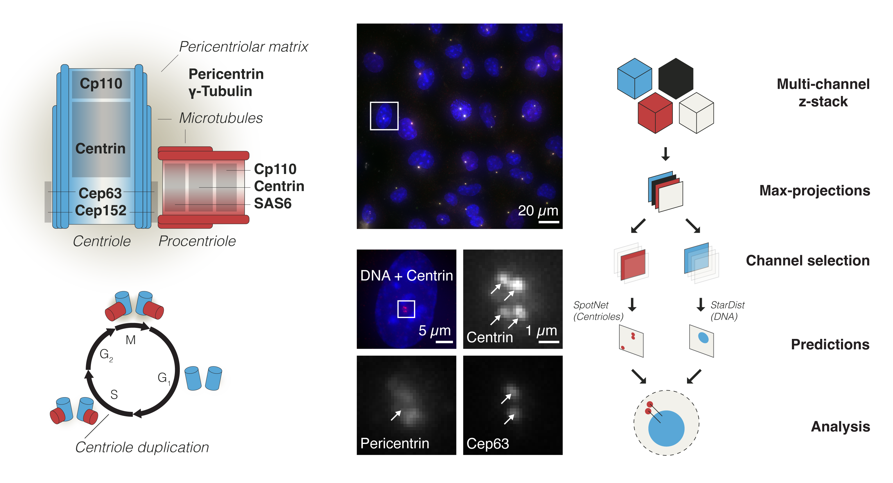

.. Cenfind documentation master file, created by
   sphinx-quickstart on Wed Sep 20 11:29:35 2023.
   You can adapt this file completely to your liking, but it should at least
   contain the root `toctree` directive.

Automatic cell scoring for centrioles
=====================================

**Cenfind** is a pipeline that automates centriole detection and their assignment to nucleus. It combines two trained network that will locate centrioles from centriole marker channel.

This documentation explains what is Cenfind, how to install it and apply it on your dataset.
It also describes how to interpret and use the output of the pipeline.
Then it showcases typical applications.
For more advanced usage, it explains how to train a custom model if the dataset is too divergent.
Finally, it explains the architecture of the API.

Check out the :doc:`usage` section for further information including how to :ref:`install <installation>` the pipeline.

.. warning::
   The project and its documentation are not anymore under active development. Please contact the lab https://www.epfl.ch/labs/gonczy-lab/lab-members/ for further information about potential development.

Contents
--------

.. toctree::
   :maxdepth: 2

   usage
   inference
   statistics
   retraining
   architecture
   api
   contribute
   citation
