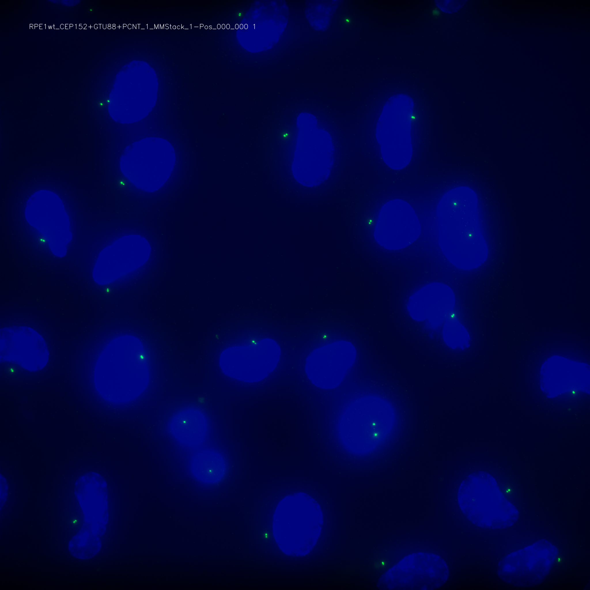

Retraining
==========

Evaluating the quality of the model on a new dataset
----------------------------------------------------

The initial model M is fitted using a set of five representative datasets, hereafter referred to as the standard
datasets (DS1–5).
If your data deviates too much from the standard dataset, M may perform less well.

Specifically, when setting out to score a new dataset, you may be faced with one of three situations, as reflected by
the corresponding F1 score (i.e., 2TP/2TP+FN+FP, TP: true positive, FP: false positive; FN: false negative):
(1) the initial model (M) performs well on the new dataset (0.9 ≤ F1 ≤ 1); in this case, model M is used;
(2) model M performs significantly worse on the new dataset (0.5 ≤ F1 < 0.9); in this case, you may want to consider
retraining the model (see below);
(3) the model does not work at all (0 ≤ F1 < 0.5); such a low F1-value probably means that the features of the dataset
are too distant from the original representative dataset to warrant retraining starting from M.

Before retraining a model (2), verify once more the quality of the data, which needs to be sufficiently good in terms of
signal over noise to enable efficient learning.
If this is not the case, it is evident that the model will not be able to learn well.
If you, as a human being, cannot tell the difference between a real focus and a stray spot using a single channel at
hand (i.e., not looking at other channels), the same will hold for the model.

To retrain the model, you first must annotate the dataset, divide it randomly into training and test sets (90 % versus 10 % of the data, respectively).
Next, the model is trained with the 90 % set, thus generating a new model, M*.
Last, you will evaluate the gain of performance on the new dataset, as well as the potential loss of performance on the standard datasets.

Detailed training procedure
---------------------------

1. Split the dataset into training (90%) and test (10%) sets, each containing one field of view and the channel to use.
   This helps trace back issues during the training and renders the model fitting reproducible.
2. Label all the images present in training and test sets using Labelbox. To upload the images, please create the vignettes first and then upload them once you have a project set up.
3. Save all foci coordinates (x, y), origin at top-left, present in one field of view as one text file under
   /path/to/dataset/annotation/centrioles/ with the naming scheme <dataset_name>_max_C<channel_index>.txt.
4. Evaluate the newly annotated dataset using the model M by computing the F1 score.
5. If the performance is poor (i.e., F1 score < 0.9), fit a new model instance, M*, with the standard dataset plus the
   new dataset (90% in each case).
6. Test performance of model M* on the new data set; hopefully the F1 score will now be ≥ 0.9 (if not: consider
   increasing size of annotated data).
7. Test performance of model M* on the standard datasets; if performance of F1* ≥ F1, then save M* as the new M (
   otherwise keep M* as a separate model for the new type of data set).

How to save annotation
----------------------

We recommend the tool Labelbox to annotate the dataset. In this respect, CenFind provides ``cenfind vignettes`` that creates 2-channel images ready for export to Labelbox. Specifically, each image will be saved as 8-bit PNG with a text label indicating the file name and the centriolar channel used. Moreover, the nuclei will appear in the background to help you discriminate real foci from stray spots. In a second step, you can load those vignettes in you Labelbox session and create a new project. Finally, when you are done with the annotation, you need to download the annotations and save them under annotations/centrioles/ in one file per field-channel pair with the file name as <field_name>_C<channel>.txt.

.. code-block:: shell
    usage: CENFIND vignettes [-h] --channel_nuclei CHANNEL_NUCLEI --channel_centrioles CHANNEL_CENTRIOLES [CHANNEL_CENTRIOLES ...] [--projection_suffix PROJECTION_SUFFIX] dataset

    positional arguments:
    dataset               the path to the dataset

    optional arguments:
    -h, --help            show this help message and exit
    --channel_nuclei CHANNEL_NUCLEI, -n CHANNEL_NUCLEI
                        the index of the nuclei (often, 0 or 3, first or last) (default: None)
    --channel_centrioles CHANNEL_CENTRIOLES [CHANNEL_CENTRIOLES ...], -c CHANNEL_CENTRIOLES [CHANNEL_CENTRIOLES ...]
                        the index of the channels (default: None)
    --projection_suffix PROJECTION_SUFFIX, -s PROJECTION_SUFFIX
                        the suffix indicating projection, e.g., `_max` or `_Projected`, empty if not specified (default: )

Below is an example vignette with nuclei in blue and the centriolar channel in green:

Training a new model
--------------------

To retrain a new model, you can simply run ``cenfind train`` and pass the dataset that contains the projections and the corresponding annotations (in annotations/centrioles/*.txt), as well as the parent folder in which the model weights will be saved. You will also specify the number of epochs to train.

.. code-block:: shell
    usage: CENFIND train [-h] --model_path MODEL_PATH --epochs EPOCHS datasets [datasets ...]

    positional arguments:
      datasets              Path to the dataset

    optional arguments:
      -h, --help            show this help message and exit
      --model_path MODEL_PATH
                            Path to the model fit (default: ./)
      --epochs EPOCHS       Number of epochs (default: 1)

Using spotiflow
---------------

CenFind uses an old version of Spotiflow, namely Spotipy. We highly recommend to follow the instructions from Spotiflow (https://github.com/weigertlab/spotiflow/) to train a newer model and to adapt CenFind to process the output of Spotiflow.